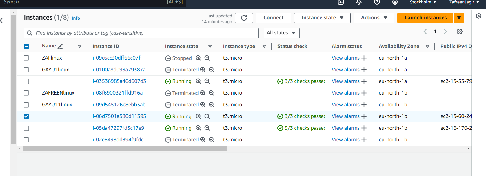
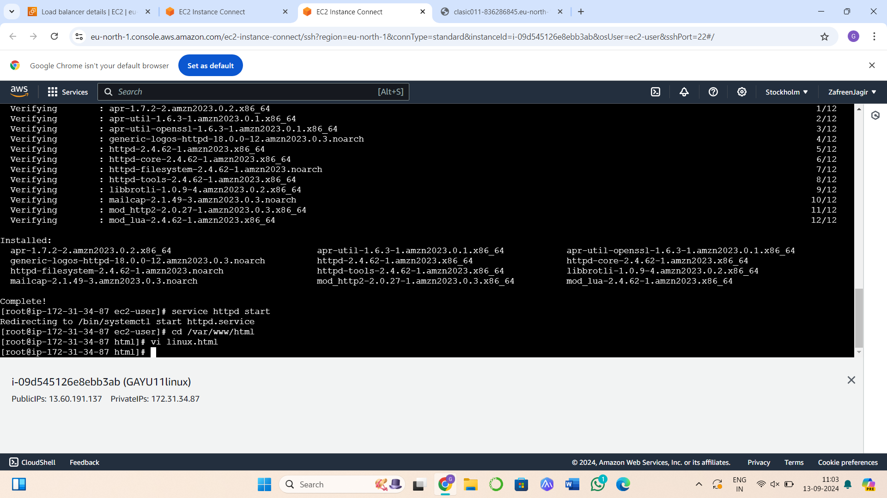
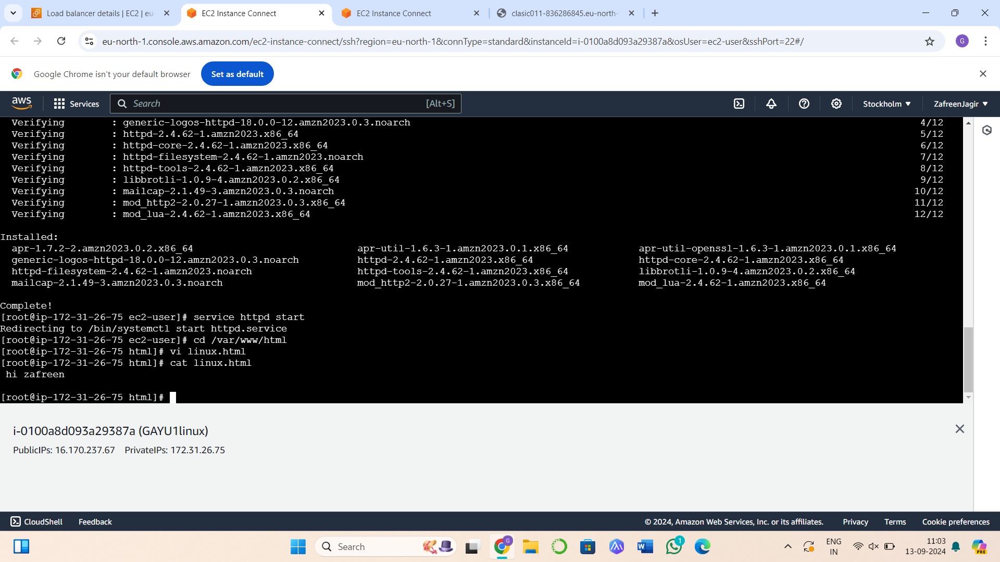

# SETTING UP A SCALABLE FILE STORAGE SYSTEM USING AMAZON ELASTIC FILE SYSTEM
## AIM :
To set up a scalable file storage system using Amazon Elastic File System (EFS) for two EC2 instances in different availability zones, enabling shared access to data.

## PROBLEM STATEMENT :
This experiment demonstrates how to configure Amazon EFS to provide a shared storage solution for two Linux EC2 instances across different availability zones, enabling easy data sharing. The aim is to ensure both instances can mount and access the EFS file system and validate data consistency across instances.

## ALGORITHM
 ### Steps 1: Create two EC2 instances in different availability zones.
 ### Steps 2: Set up a security group that allows necessary communication between the instances and EFS.
 ### Steps 3: Create an EFS file system and mount it to both EC2 instances.
 ### Steps 4: Ensure that the EC2 instances can access the file system and share data between them.

### REG NUMBER: 212222100048
### NAME: SATHISH R

## COMMANDS
## EC2 Instance 1
```
sudo su
yum install httpd -y
yum install -y amazon-efs-utils
mount -t efs -o tls fs-064645ac116a12816:/ /var/www/html
cd /var/www/html
vi file  # Create a file and add some text
```
## EC2 Instance 2
```
sudo su
yum install httpd -y
yum install -y amazon-efs-utils
mount -t efs -o tls fs-064645ac116a12816:/ /var/www/html
cd /var/www/html
ls
cat file  
```
## OUTPUT








## RESULT
 Thus, The setting up a scalable file storage system using Amazon Elastic File System (EFS) for two EC2 instances in different availability zones, enabling shared access to data is executed successfully.

  


